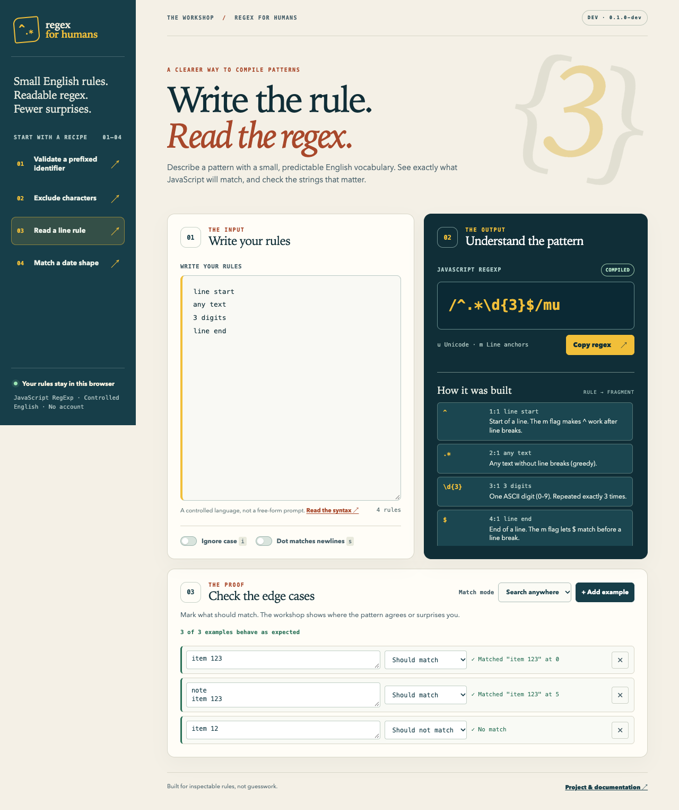
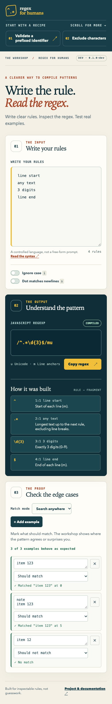

# Regex For Humans

[](https://github.com/OthmaneBlial/Regex-For-Humans/actions/workflows/ci.yml)

**Write a short rule. Get a JavaScript regex you can inspect and test.**

Regex For Humans uses a small, explicit English vocabulary. It does not guess what arbitrary text means. The same compiler powers a JavaScript library, a CLI, and a local browser workshop.

> **Status:** Development build. Not on npm; the workshop is not hosted; no GitHub release or standalone binary.

## Try it

Requires Node.js 22 or newer.

```sh
git clone https://github.com/OthmaneBlial/Regex-For-Humans.git
cd Regex-For-Humans
printf 'start "ABC"\n3 digits\nend\n' | node bin/regex-for-humans.js
```

```text
/^ABC\d{3}$/u
```

`ABC123` matches. `ABC12`, `ABC1234`, and `abc123` do not. Add `--explain` to see each rule's regex fragment, or `--json` for structured output and source locations. Run `node bin/regex-for-humans.js --help` for all options.

## Open the workshop

From the repository:

```sh
npm ci
npm run build
npm run serve
```

Open **http://127.0.0.1:4174/**. Choose a recipe, edit its rules, then check positive and negative examples. The compiler runs in the browser; entered rules and examples are not sent to an application backend. Matching runs in a worker with a timeout. See the [security model](docs/SECURITY_MODEL.md).



<details>
<summary>Mobile workshop</summary>



</details>

These are unedited captures of the local development build. [Capture details and checksums](media/screenshots/README.md).

## Use the library

```js
import { compile, toRegExp } from './index.js';

const result = compile('start 3 digits\nend');
console.log(result.source); // ^\d{3}$
console.log(toRegExp(result).test('123')); // true
```

Import `./index.js` from a checkout. The package is not yet available from npm.

## Syntax at a glance

| Rule | Example | JavaScript source |
| --- | --- | --- |
| Input bounds | `start` · `end` | `^` · `$` |
| Line bounds | `line start` · `line end` | `^` · `$` with `m` |
| Character | `digit` · `not digit` | `\d` · `\D` |
| Repeated digits | `3 digits` | `\d{3}` |
| One or more digits | `digits` | `\d+` |
| Literal text | `"ABC"` | `ABC` |
| Character set | `one of: a, b` | `[ab]` |

Longer phrases remain supported. Unknown rules and duplicate counts report their location. The [language guide](docs/LANGUAGE.md) defines the exact syntax, escaping, flags, limits, and examples. Output targets JavaScript `RegExp`; groups, alternation, lookaround, backreferences, and arbitrary raw regex are outside version 1.

## Develop

```sh
npm ci
npm run check
npm test
npm run build
npm run test:package
npx playwright install chromium
npm run test:browser
```

The current suites contain 45 Node tests and 34 browser tests. [Testing and compatibility](docs/TESTING.md) records versions and evidence limits. See [contribution guide](CONTRIBUTING.md), [architecture](docs/ARCHITECTURE.md), [roadmap](ROADMAP.md), and [MIT license](LICENSE).

Report security issues through the private process in [SECURITY.md](SECURITY.md). The [changelog](CHANGELOG.md) records project changes.
